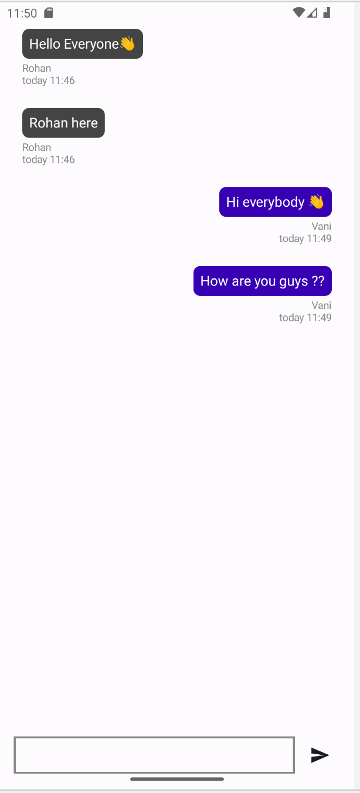

# Chat Room App

The ChatRoomApp is a real-time messaging application developed in Kotlin & Jetpack Compose. It supports User Authentication and multiple chat rooms, ensuring scalability & optimization.

## Features

- Create a Public ChatRoom
- Can join any ChatRoom
- User Authentication

## Tech Stack

**Client:** Kotlin

**Server:** Firebase Firestore, Firebase Authentication

## Screenshots

### Signup Screen

### Home Page

### Chat Screen

