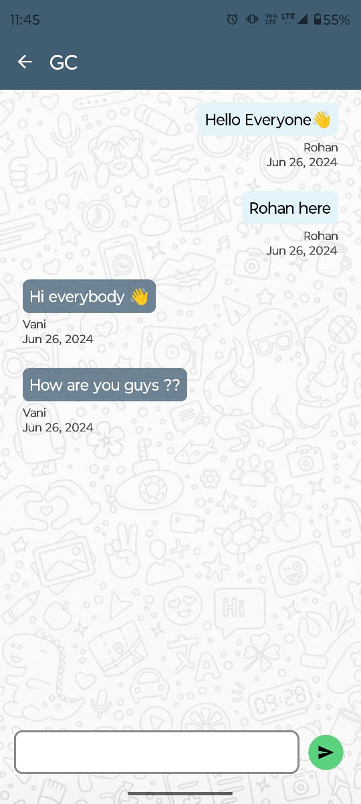

# ChatRoomApp

**ChatRoomApp** is a real-time messaging application built with Kotlin and Jetpack Compose. It allows users to communicate seamlessly across multiple chat rooms with robust authentication features. Designed for scalability and optimized performance, ChatRoomApp is your go-to solution for connecting people in real-time.

## 🚀 Features

- **Create Public Chat Rooms:** Start a chat room with just a tap and invite others to join.
- **Seamless Communication:** Enjoy smooth, real-time messaging across all chat rooms.
- **User Authentication:** Securely log in and manage your sessions with Firebase Authentication.
- **Dark Mode Support:** Switch between light and dark modes (System) for a comfortable user experience in any lighting condition.

## 🛠️ Tech Stack

- **Client:** Kotlin & Jetpack Compose
- **Server:** Firebase Firestore & Firebase Authentication

## 📸 Screenshots

### 🔑 Signup Screen
Get started by signing up with your credentials.

### 🏠 Home Page
View a list of available chat rooms and join any conversation.

### 💬 Chat Screen
Experience smooth and intuitive messaging in both light and dark modes.

| Light Mode  | Dark Mode |
|-------------|-----------|
|  |  |

## 📚 How to Get Started

1. **Clone the Repository:**  
   `git clone https://github.com/RohanRudra/ChatRoomApp.git`

2. **Open the Project in Android Studio.**

3. **Configure Firebase:**
   - Set up Firebase Authentication and Firestore in your Firebase console.
   - Add the `google-services.json` file to your project's `app` directory.

4. **Run the App on Your Device or Emulator.**

## 🌟 Contributions

Contributions are welcome! Feel free to fork the project, make improvements, and submit a pull request.

---

**Enjoy chatting with the world** 💬🌙

